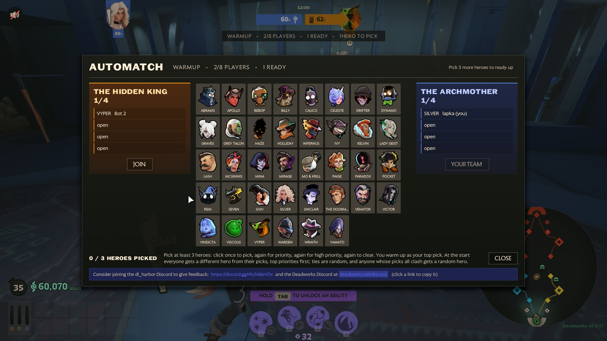

# AutoMatch

**AutoMatch** is a [Deadworks](https://deadworks.net) plugin that runs Deadlock matches on a dedicated server with
nobody hosting them. Players warm up and pick heroes, a match starts once enough of them are in, and when it ends the
server goes back to warmup.



## Match flow

1. **Warmup.** The match map as a sandbox: max souls, quick respawns, free side switching. Each player picks at least
   three heroes in the hero picker (`!hero`), raising any of them to priority or high priority, and warms up as their
   top pick.
2. **Start.** A full server (`PlayersToStart`) starts after `MinWarmupSeconds`. A smaller one starts once at least
   `MinPlayersToReadyUp` players are in and all of them are ready (`!ready`).
3. **Draft.** Everyone gets a different hero, from their own picks where possible, highest priority first. Ties go to
   whoever missed their top pick in the last draft, then at random. A player whose picks can't be met gets a random
   hero.
4. **Match.** The map reloads and waits for everyone to load in, up to `LoadInSeconds`. Then the usual countdown in
   base and zipline launch, with each team spread across `Lanes`.
5. **Back to warmup** when the Patron falls, or after the server has been empty for `EmptyServerSeconds`.

During a match:

* A player who leaves can reconnect to their hero. Until then it waits in base, frozen, and the next player in line
  takes it over, with its levels, souls and items.
* A player who joins while a place is open picks a hero and spawns with souls to match their team.
* A player idle for `AfkKickSeconds` is warned, then kicked. This counts as leaving.
* A team forfeits once all of its players have voted `!ff`.

When the server is full, new players spectate and wait in line. Owners can reserve slots for admins, and admins can
spectate instead of playing.

## Requirements

* Deadworks v0.4.17 or later.
* Players must connect through the Deadworks launcher. The hero picker needs the Deadworks client bootstrap, which only
  the launcher installs. Anyone without it is warned three times, then kicked (see `BootstrapCheckSeconds`).
* A map players can get. The launcher downloads maps from the Deadworks registry, such as dl_harbor, automatically.

## Installation

1. Copy `AutoMatch.dll` to `game/bin/win64/managed/plugins/`.
2. Start the server once. This writes the config to `game/bin/win64/configs/AutoMatchPlugin/AutoMatchPlugin.jsonc`.
3. Add your SteamID64 to `Owners`, set `Map` and `Lanes`, and restart.

Recommended launch options:

```
+map dl_harbor -maxplayers 12 +sv_hibernate_when_empty 0
```

`-maxplayers` should cover `PlayersToStart`, the reserved admin slots, and a few spectators.

**Warning:** Replacing `AutoMatch.dll` on a running server reloads the plugin, and with it the map, for everyone
connected.

## Configuration

`AutoMatchPlugin.jsonc`:

| Setting | Default | Description |
|---|---|---|
| `Map` | `""` | Map to play on. Empty keeps the server's map. |
| `Owners` | `[]` | SteamID64s of the server's owners. Owners appoint admins and reserve slots from `!admin`. |
| `FeedbackDiscord` | `""` | Discord invite shown in the hero picker, next to the Deadworks Discord. |
| `FeedbackDiscordName` | `""` | Name for that Discord, as in "the dl_harbor Discord". |
| `PlayersToStart` | `8` | Players in a full match, split between the teams. Even, 2 to 24. |
| `MinPlayersToReadyUp` | `2` | Fewest players that can start early by readying up. |
| `MinWarmupSeconds` | `60` | Shortest warmup before a full server starts. |
| `MinHeroPicks` | `3` | Heroes a player must pick before readying up. 1 to 10. |
| `BootstrapCheckSeconds` | `20` | Time a new player has to show they have the client bootstrap. `0` disables the check. |
| `MatchFoundSeconds` | `5` | Countdown before the map reloads for a match. |
| `LoadInSeconds` | `90` | Longest wait for players to load into a match. |
| `PreGameSeconds` | `30` | Time in base before the zipline launch. |
| `PostGameSeconds` | `15` | Time on the result screen before warmup. |
| `EmptyServerSeconds` | `60` | How long an empty match waits before going back to warmup. |
| `WarmupSouls` | `60000` | Souls each hero gets in warmup. The default reaches max level. |
| `WarmupRespawnSeconds` | `3` | Respawn time in warmup. |
| `LateJoinPickSeconds` | `20` | Time a mid-match joiner has to pick before a hero is picked for them. |
| `AfkKickSeconds` | `180` | Idle time before a kick, with warnings at one minute and 30 seconds. `0` disables it. |
| `Lanes` | `[4, 1, 6]` | Lanes each team fills, in order: `1` Yellow, `3` Green, `4` Blue, `6` Purple. List only lanes the map has. |

Example for dl_harbor, which has the Yellow and Blue lanes:

```jsonc
{
  "Map": "dl_harbor",
  "Owners": [76561197960287930],
  "Lanes": [1, 4]
}
```

Admins appointed in game, and the number of reserved slots, are saved to `admins.json` in the same folder.

## Commands

### Chat

Type these in chat with `!` or `/`.

| Command | Description |
|---|---|
| `hero [name]` | Opens the hero picker. With a name, steps that hero's pick up a level, as clicking it does. |
| `ready` | Readies up in warmup. |
| `side <king\|archmother>` | Switches sides in warmup. |
| `ff` | Votes to forfeit the match. |
| `admin` | Opens the admin panel. Admins only. |

### Console

Admins can run these from their game console. They also work from the server console and RCON.

| Command | Description |
|---|---|
| `dw_am_status` | Prints the roster, the line and any parked heroes. |
| `dw_am_start` | Starts the match now with whoever is here. |
| `dw_am_warmup` | Abandons the match and returns to warmup. |
| `dw_am_end <king\|archmother>` | Ends the match with a winner. |
| `dw_am_killpatron <king\|archmother>` | Wins the match for a team by destroying the enemy shrines and Patron. |
| `dw_am_setlane <slot> <1\|4\|6>` | Sets a player's lane before the zipline launch. |
| `dw_am_takeover <to slot> <from slot>` | Moves one player's hero to another player. |
| `dw_am_kick <slot>` | Kicks a player as the AFK kick would. |
| `dw_am_specteam <0\|1\|2\|3>` | Moves spectators to another team. |
| `dw_am_heroes` | Lists the pickable heroes. |
| `dw_am_bots [count]` | Adds bots. For testing. |

## Building

Requires the .NET 10 SDK and a Deadlock install with Deadworks.

```
dotnet build -c Release
```

The project looks for Deadworks in Steam's default library. If yours is elsewhere, pass
`-p:DeadworksDir=<Deadlock>\game\bin\win64`, or set it in a `local.props` next to `AutoMatch.csproj`:

```xml
<Project>
  <PropertyGroup>
    <DeadworksDir>D:\SteamLibrary\steamapps\common\Deadlock\game\bin\win64</DeadworksDir>
  </PropertyGroup>
</Project>
```

Each build is copied into that install's `managed/plugins` folder. `-p:DeployToGame=false` skips the copy.
